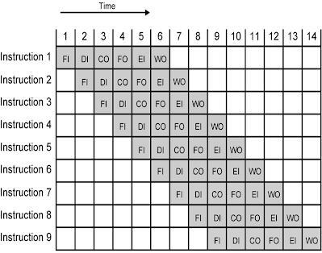
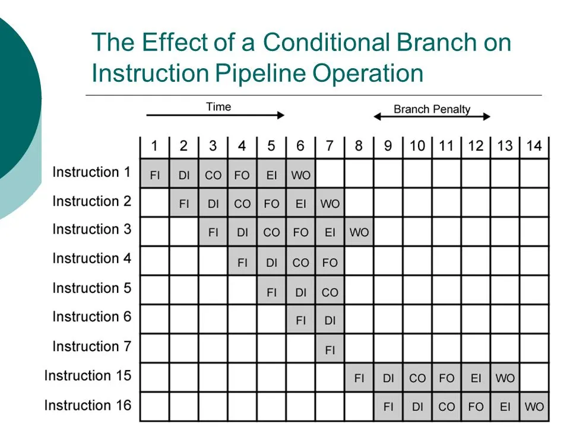

O termo *pipeline*, ou tubulações em uma tradução direta, é comumente usado na
computação quando temos um processo bem definido por etapas. Geralmente, quando
usamos esse termo, queremos dizer que existe a capacidade de *enfileirar*
operações de modo sistemático e, muitas vezes, com alguma otimização de tempo
possível ao se aproveitar o tempo de espera de uma das operações para fazer com
que outra(s) avance(m). Quando falamos de *pipeline* no contexto das *CPUs*, a
segunda interpretação é a mais valiosa.

Como vimos anteriormente, as *CPUs* modernas seguem a arquitetura delineada por
Von Neumann. Isso significa ter dois ciclos claros; um de busca e outro de
execução. No entanto, qualquer pessoa que já tentou implementar os circuitos
lógicos necessários para reproduzir esses dois ciclos consegue atestar que, na
verdade, esse ciclo se subdivide em micro operações menores. A saber:

* Busca da instrução (*Fetch Instruction - FI*) - esse processo é simples e
  envolve buscar a instrução na memória utilizando o endereço apontado pelo
  *program counter*
* Decodificação da instrução (*Decode Instruction - DI*) - para quem só trabalhou
  com o projeto de *CPUs* mais simples, esse passo pode soar estranho, como se
  houvesse alguma dificuldade ou necessidade real de chamar de *decodificação*
  uma simples separação de bits. Para acabar com essa estranheza, considere a
  simples possibilidade de uma *CPU* ter mais de um tipo de formatação de
  instrução diferentes e um cabeçalho para definir qual tipo de instrução está
  sendo usada. Basta essa pequena complicação para que o processo de encontrar
  o *opcode* e os *operandos* se transforme em uma *decodificação*.
* Calculo dos operandos (*Calculate operands - CO*) - nem sempre esta etapa é
  necessária, mas devemos considerá-la para os casos em que trata-se de um
  endereçamento que exige algum tipo de cálculo.
* Busca dos operandos (*Fetch operands - FO*) - caso trate-se de operandos com
  endereçamento imediato ou por registrador, não há a necessidade de esperar
  por um acesso à memória. Para todos os outros casos, essa etapa envolve
  aguardar uma operação de I/O.
* Execução da instrução (*Execute instruction - EI*) - aqui é onde a operação
  de fato é executada. Esta etapa pode ser praticamente instantânea ou envolver
  mais transferência de dados e espera por operações de I/O. Depende
  completamente do tipo de operação que precisa ser feita.
* Escrita do operando (*Write Operands - WO*) - quando especificado, armazenar
  o resultado da operação em memória.

Ao analisar com cuidado essas etapas do ciclo de execução de uma instrução, é
possível perceber um padrão: há um potencial para **muita espera** e *pouca
ação* direta do processador. Em outras palavras, há potencial para otimizar
esse ciclo. Como? Fazendo com que mais de uma operação execute ao mesmo tempo,
em que cada uma fica em um estágio diferente.

A imagem abaixo mostra o cenário ideal, onde 9 instruções são *enfileiradas* ao
mesmo tempo; cada uma em uma etapa diferente de execução.

Note que, neste caso, a primeira operação é concluída após **6 ciclos** e as
operações subsequentes são concluídas com um intervalo de apenas **um ciclo**
entre elas. Contraste isso com uma situação em que nenhuma estratégia de
*pipeline* seja utilizada; neste caso, teríamos um intervalo constante de **6
ciclos** entre cada operação. Esse é o poder do *pipeline*.

No entanto, nem tudo são flores. O diagrama acima parte da premissa de que
todas as instruções necessariamente passam pelas 6 microoperações e isso
evidentemente não é verdade. Além disso, não consideramos a possibilidade de
duas etapas concorrerem pelo uso do mesmo **recurso**. Embora seja muito comum
que uma *CPU* mais moderna tenha mais de um barramento, ainda assim é
improvável que não haja um *gargalo* quando mais de uma operação requer o uso
dos mesmo componentes ao mesmo tempo.

Como um terceiro desdito na vida dos *pipelines* e com um destaque por ser o
pior contratempo temos as **instruções com salto condicional**. O que fazer
quando uma das instruções enfileiradas é de salto condicional? O problema é
claro: pode ser que todas as instruções enfileiradas atrás do salto condicional
se tornem incorretas, pois o salto acontece e leva o programa para outro lugar
de memória. Nesse caso, o que ocorre? Bem, ocorre que precisamos **jogar fora
toda a fila**. A imagem abaixo exemplifica esse tipo de atraso.

O atraso causado pelo salto condicional faz com que o intervalo entre operações
volte a ser de **6 ciclos** nos casos em que ele ocorre. Embora isso não seja o
suficiente para descreditar completamente a estratégia, acho que vale a pena
estudarmos com mais calma e de forma mais estruturada o que pode dar errado em
um *pipeline*. A seguir, vamos falar sobre os **hazards de pipeline**.
